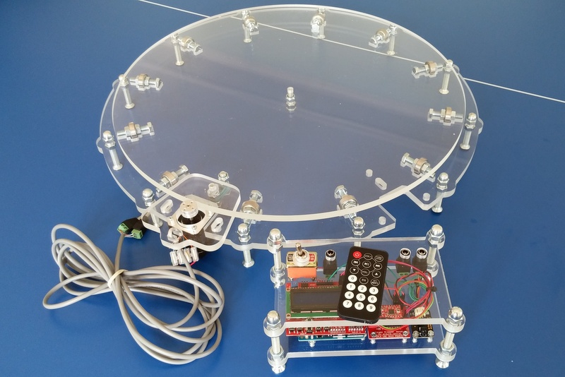

# PhotoPizza DIY
# 360° PRODUCT PHOTOGRAPHY TURNTABLE

PhotoPizza - is an open source project of the turntable for taking pictures of objects from all directions
(3D-photo-360 spin-photo).
The control unit platform is based on the Espruino.
You can self-assemble the device from the available components,
using the detailed instructions, and you do not need deep knowledge in electronics.

###UPDATE 2024

Photopizza's original repository does not appear to be maintained any more.  The <a href="www.photopizza.org">website</a> appears to be offline as well, though there are some links in wayback machine.  No luck contacting the author.

The good news is that the project is about 80% complete.

The project is not consolidated in one place, but there are bits and pieces scattered around.  One could likely infer the unspecified hardware by checking measurements of component holes in the CAD drawings against McMaster Carr catalogues as well as examining the firmware and Arduino Sketches.

This fork is an attempt to collect all the information on the project and populate it with all neccessary instructions and resources, and hopefully invite some community involvement.

###LINKS###

<a href="https://web.archive.org/web/20201022083415/http://makerdrive.org/project/item/photopizza#!prettyPhoto">archived photopizza blog</a>

<a href="https://web.archive.org/web/20221026012420/https://photopizza.org/">archived photopizza website</a>

<a href="https://www.youtube.com/c/PhotoPizza">original photopizza youtube</a>

<a href="https://www.instagram.com/diy.photopizza/">original photopizza instagram</a>

<a href="https://habr.com/ru/articles/247315/">blog post 1 (Russian, use Google Translate)</a>

<a href="https://habr.com/ru/articles/238287/">blog post 2 (Russian, use Google Translate)</a>

<a href="https://sketchfab.com/3d-models/automatic-rotary-table-photopizza-d700-0adc2a0adfff4fdca613fcbd9919bce4">sketchfab model</a>

    ***note: this sketchfab model uses an outdated design (you can see that the linkage connected the motor carraige to the base is using rubber rings instead of bolts.  This appears to be the main distinction between v7 and and the previous versions)***

Re: Lasercut drawings 

Have not tested them yet, but they should work for lasercutting.

If you are trying to use the CAD drawings to create a 3D model, the toolpaths are not set as correct subtractive shapes (only some holes will be created when extruding the base and platter).  I fixed this by reorganizing the paths in Adobe Illustrator, but only for the 700mm v7 drawing.  

If you are not making a 3D model with the data for previs or customization, it can be safely ignored.

Currently need:

1.Parts list / BOM
* Nuts
* Bolts
* Bearings
* NEMA motor
* Friction drive roller
* Remote control from blog photos(IR? Radio?)
* Motor driver
* Hardware controllers (buttons, switches, shutter ports, wires)

2. Software
* Testing of current firmware / app
* Configuration and operation instructions (see blog and archived website links for info on remote control operation)

3. Schematics
* Schematics for Arduino + Motordriver + Remote control receiver, Shutter ports, etc

